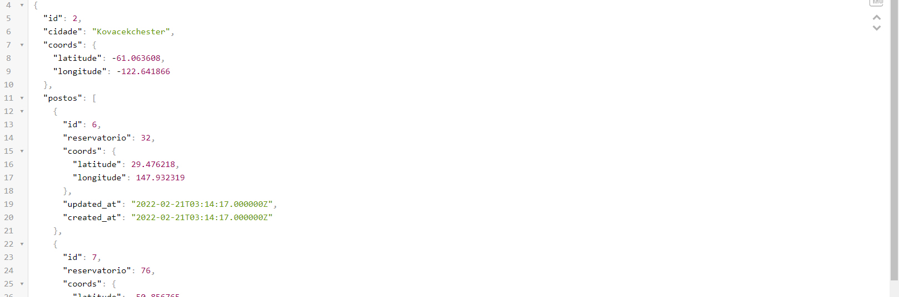
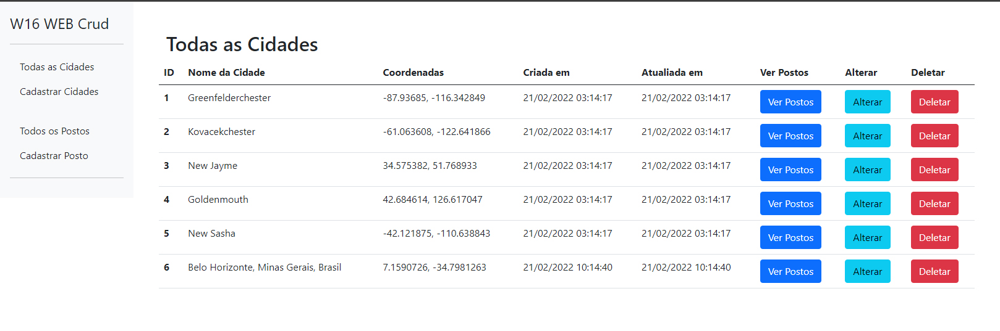
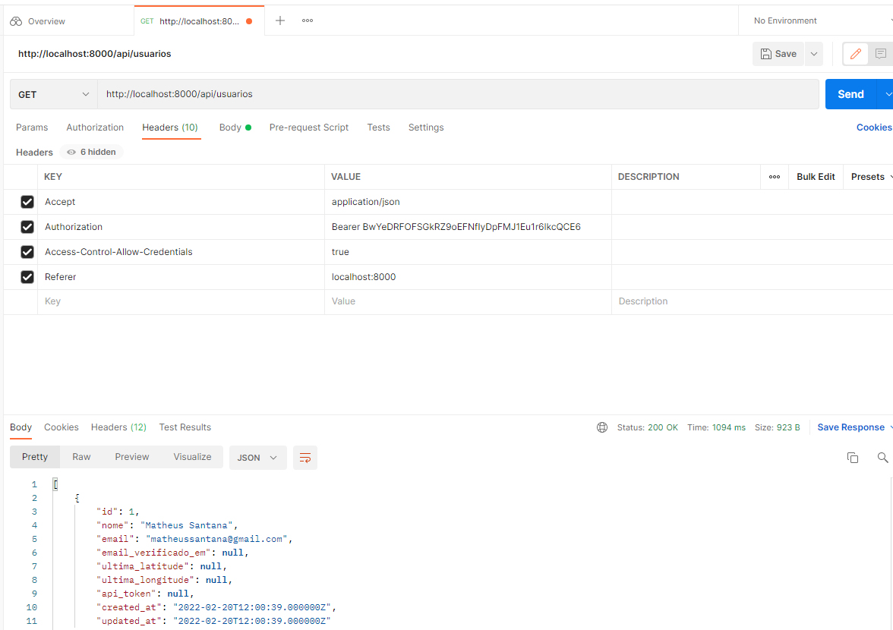
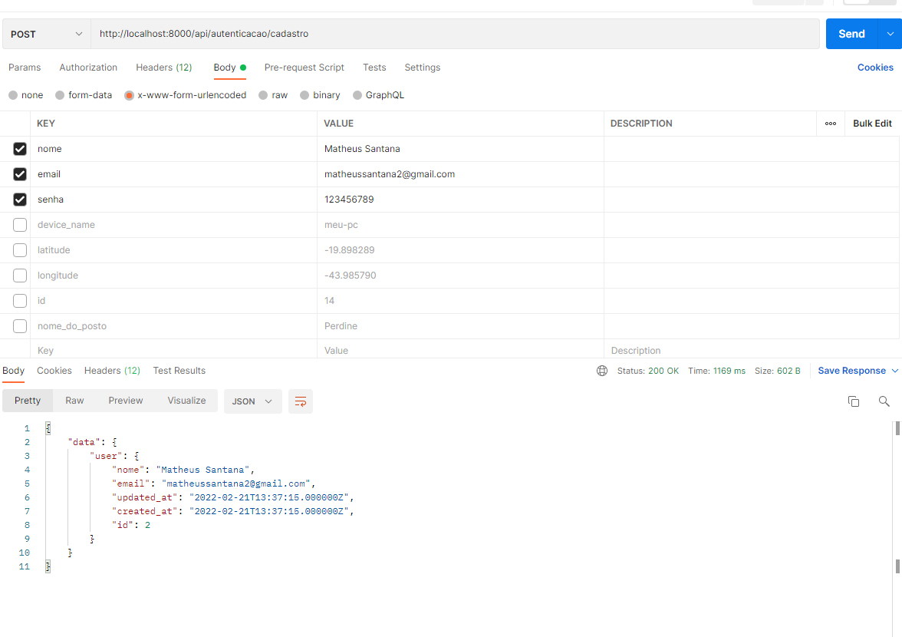
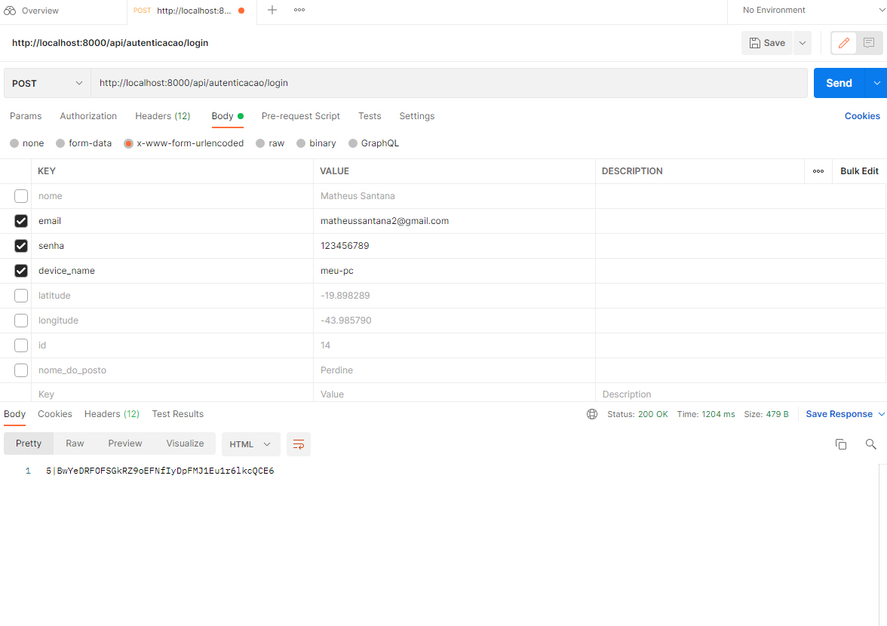
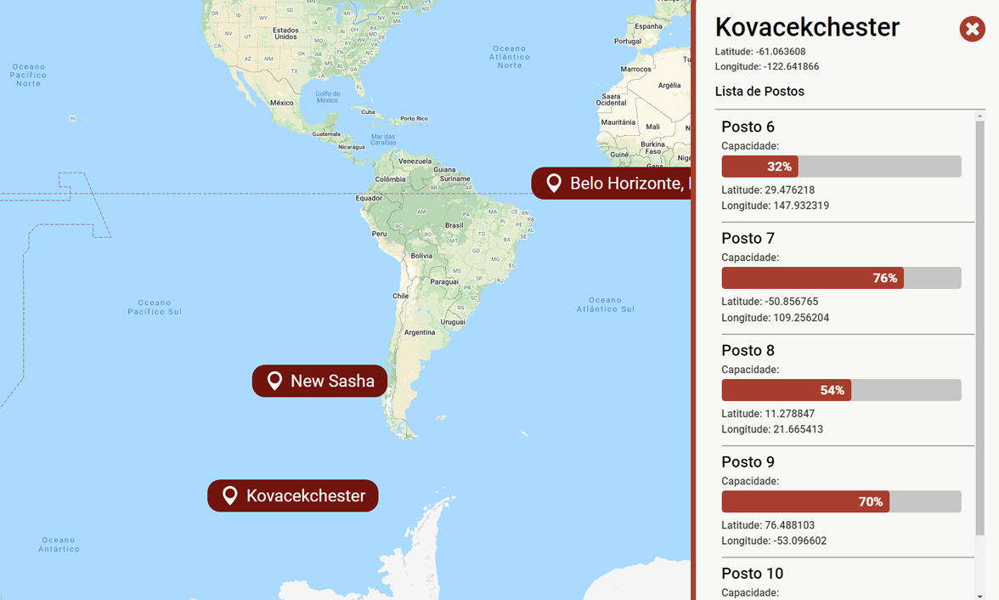

## Teste Contratação Desenvolvedor W16

Olá, me chamo Matheus Felipe, estou enviando meu teste para a vaga de Full Stack PHP/React.
Não efetuei outros recursos pelo tempo de entrega.

• Crud Web: Sim
• Autenticação Api: Sim
• Seeder e uso de Fakers: Sim
• Teste: Não

## Pasta Laravel-Api

Possui o código da Api utilizando Laravel 8.

- Api possui os seguintes Endpoints

    //Sem Autenticação
    • api/cidades | GET: Retorna a coleção completa de cidades cadastradas seguindo as especificações solicitadas
    • api/cidade | GET, POST, PUT, DELETE: Resources de cidade
    • api/postos | GET: Retorna todos os postos cadastrados
    • api/posto | GET, POST, PUT, DELETE: Resource de Posto

    //Autenticado com Sanctum
    • api/autenticacao/cadastro | POST: Cadastra usuário para acessar o endpoint api/autenticacao/login, e retornar Token de Autorização
    • api/autenticacao/login | POST: Efetua login com os dados cadastrados e retorna um Token para utilização no endpoint api/usuarios
    • api/usuarios | GET: Necessária autenticação, enviar Bearer Token no header Authorization

- Web possui os seguintes Endpoints

    • /cidades/{id}/postos ! GET: Retorna os pontos da cidade
    • /cidades | GET, POST, PUT, DELETE: Resources da classe City, que representa o banco de dados cidades
    • /postos | GET, POST, PUT, DELETE: Resources da classe GasStation, que representa o banco de dados cidades

- Alterações Importantes:
    • Adicionado Middleware no Kernel para autorização de Cors
    • Tradução dos campos da classe User, para manter o padrão das tabelas cidades e postos

## Pasta React

Possui um webapp básico que consume endpoints da API, e renderiza os pontos em um componente Google Maps.
Ao escolher uma cidade, abre uma Sidebar com os dados de todos os Postos da cidade selecionada.

## Obrigado pela oportunidade!

## Laravel

## React

